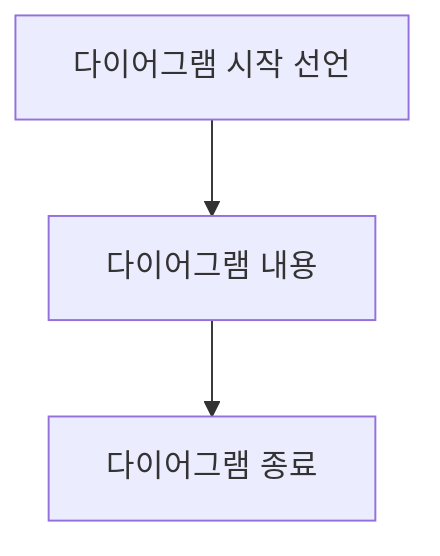
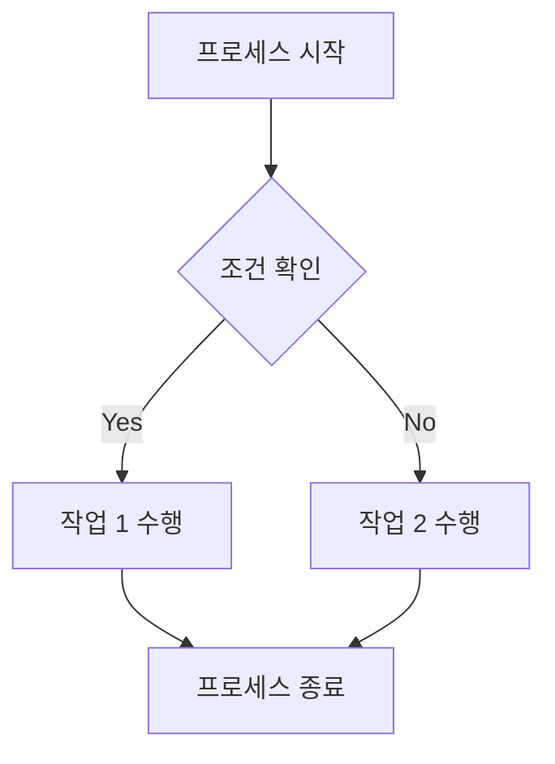

# Mermaid 문법 기본

## 다이어그램 시작과 종료 선언

Mermaid에서 다이어그램을 그리려면 먼저 시작을 명확히 선언해야 함. 이는 Mermaid 파서가 다이어그램의 범위를 인식하고 올바르게 렌더링하기 위해 필수적임.

### 기본 구조

```text
graph TD
    A[다이어그램 시작 선언] --> B[다이어그램 내용]
    B --> C[다이어그램 종료]
```



### 다이어그램 유형별 시작 선언

1. 플로우차트:

   ```text
   graph TD
   ```

   또는

   ```text
   flowchart TD
   ```

2. 시퀀스 다이어그램:

   ```text
   sequenceDiagram
   ```

3. 클래스 다이어그램:

   ```text
   classDiagram
   ```

4. 상태 다이어그램:

   ```text
   stateDiagram-v2
   ```

5. ER 다이어그램:

   ```text
   erDiagram
   ```

6. 간트 차트:

   ```text
   gantt
   ```

7. 파이 차트:

   ```text
   pie
   ```

### 방향 지정

플로우차트의 경우, 방향을 지정할 수 있음:

- `TD` 또는 `TB`: Top to Bottom (위에서 아래로)
- `BT`: Bottom to Top (아래에서 위로)
- `LR`: Left to Right (왼쪽에서 오른쪽으로)
- `RL`: Right to Left (오른쪽에서 왼쪽으로)

예시:

```text
graph LR
    A[시작] --> B[프로세스]
    B --> C[종료]
```


### 다이어그램 종료

Mermaid에서는 명시적인 종료 선언이 필요 없음. 다음 다이어그램이 시작되거나 문서가 끝날 때 자동으로 종료됨.

### 주의사항

- 시작 선언 전후로 빈 줄을 넣어 다른 텍스트와 구분하는 것이 좋음
- 여러 다이어그램을 한 문서에 포함시킬 때는 각 다이어그램 사이에 빈 줄을 넣어 구분

### 예시: 완전한 다이어그램

```text
graph TD
    A[프로세스 시작] --> B{조건 확인}
    B -->|Yes| C[작업 1 수행]
    B -->|No| D[작업 2 수행]
    C --> E[프로세스 종료]
    D --> E
```



이렇게 시작과 종료를 명확히 선언하면 복잡한 문서에서도 다이어그램을 쉽게 식별하고 관리할 수 있음. 또한 여러 다이어그램을 하나의 문서에 포함시킬 때 유용하게 활용 가능함.
