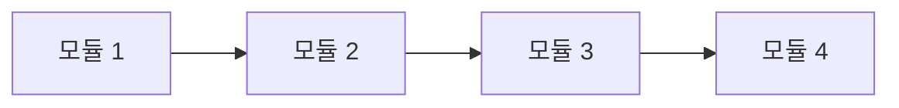
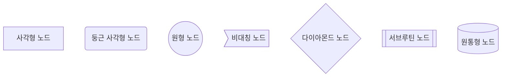
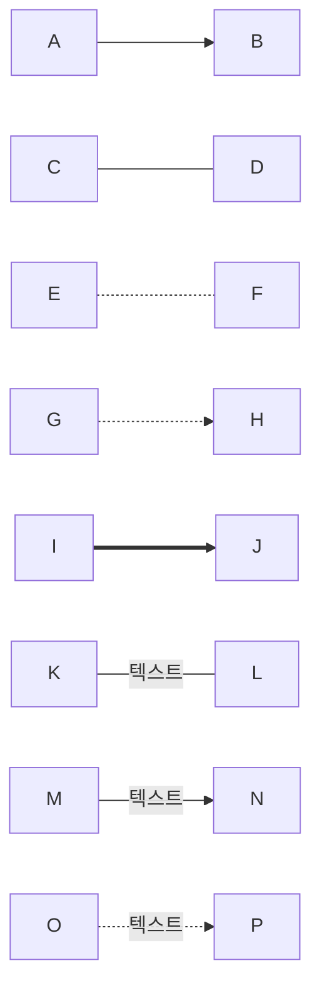
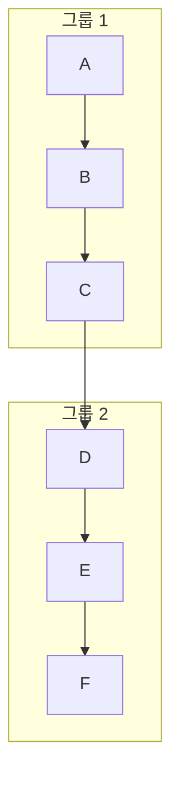
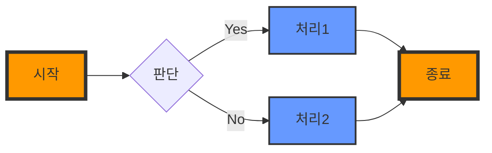

# Mermaid 문법 기본

## 다이어그램 방향과 레이아웃 설정

Mermaid에서 다이어그램의 방향과 레이아웃을 설정하는 건 시각적 명확성과 정보 전달력을 높이는 핵심 요소임. 특히 복잡한 구조를 가진 다이어그램에서 더욱 중요함.

### 기본 방향 설정

플로우차트의 기본 방향은 `graph` 키워드 뒤에 지정:

- `TD` 또는 `TB`: Top to Bottom (위에서 아래로)
- `BT`: Bottom to Top (아래에서 위로)
- `LR`: Left to Right (왼쪽에서 오른쪽으로)
- `RL`: Right to Left (오른쪽에서 왼쪽으로)

예시:

```text
graph LR
    A[모듈 1] --> B[모듈 2]
    B --> C[모듈 3]
    C --> D[모듈 4]
```



### 노드 형태 변경

노드 형태를 변경해 다이어그램의 가독성을 높일 수 있음:

```text
graph TD
    A[사각형 노드]
    B(둥근 사각형 노드)
    C((원형 노드))
    D>비대칭 노드]
    E{다이아몬드 노드}
    F[[서브루틴 노드]]
    G[(원통형 노드)]
```



### 노드 간 연결 스타일

다양한 연결선 스타일로 관계를 표현:

```text
graph LR
    A --> B
    C --- D
    E -.- F
    G -.-> H
    I ==> J
    K -- 텍스트 --- L
    M -- 텍스트 --> N
    O -. 텍스트 .-> P
```



### 서브그래프 활용

관련 노드를 그룹화해 구조를 명확히 표현:

```text
graph TB
    subgraph 그룹 1
    A[A] --> B[B]
    B --> C[C]
    end
    subgraph 그룹 2
    D[D] --> E[E]
    E --> F[F]
    end
    C --> D
```



### 스타일링

노드와 엣지에 스타일을 적용해 시각적 구분을 강화:

```text
graph LR
    A[시작]:::orangeNode --> B{판단}
    B -->|Yes| C[처리1]:::blueNode
    B -->|No| D[처리2]:::blueNode
    C --> E[종료]:::orangeNode
    D --> E
    classDef orangeNode fill:#ff9900,stroke:#333,stroke-width:4px;
    classDef blueNode fill:#6699ff,stroke:#333,stroke-width:2px;
```



### 고급 레이아웃 기법

1. 링크 길이 조절:

   ```text
   graph TD
    A[시작] -->|긴 링크| B[중간]
    A -->|짧은 링크| C[끝]
    linkStyle 0 stroke:#ff3,stroke-width:4px,color:red;
   ```

   ```mermaid
   graph TD
    A[시작] -->|긴 링크| B[중간]
    A -->|짧은 링크| C[끝]
    linkStyle 0 stroke:#ff3,stroke-width:4px,color:red;
   ```

2. 복잡한 연결 구조:

   ```text
   graph TD
    A[메인] --> B[B]
    A --> C[C]
    B --> D[D]
    C --> D
   ```

   ```mermaid
   graph TD
    A[메인] --> B[B]
    A --> C[C]
    B --> D[D]
    C --> D
   ```

이런 방식으로 다이어그램의 방향과 레이아웃을 세심하게 설정하면, 복잡한 시스템이나 프로세스도 명확하고 이해하기 쉽게 표현 가능함. 특히 대규모 프로젝트나 시스템 아키텍처를 설계할 때 유용하게 활용할 수 있음.
