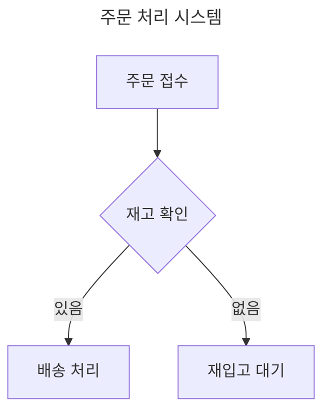

# Mermaid 문법 기본

## 주석과 메타데이터 활용

Mermaid에서 주석과 메타데이터는 다이어그램의 가독성을 높이고 추가 정보를 제공하는 데 중요한 역할을 함. 이들을 효과적으로 사용하면 다이어그램의 유지보수성과 협업 효율성이 크게 향상됨.

### 주석 사용법

Mermaid의 주석은 `%%`로 시작하며, 한 줄 전체를 차지함:

```text
graph LR
    A[시작] --> B[프로세스]
    %% 이 주석은 전체 프로세스 흐름을 설명함
    B --> C[종료]
    %% TODO: 에러 처리 로직 추가 필요
```


주석 활용 팁:

- 복잡한 로직이나 의도 설명에 사용
- 코드 리뷰나 협업 시 커뮤니케이션 도구로 활용
- 임시 내용이나 향후 작업 계획 메모

### 메타데이터 활용

메타데이터는 다이어그램에 대한 부가 정보를 제공하며, 주로 다이어그램 시작 부분에 정의함:

```text
---
title: 주문 처리 시스템
author: 개발팀
version: 1.2
date: 2024-06-27
---
flowchart TD
    A[주문 접수] --> B{재고 확인}
    B -->|있음| C[배송 처리]
    B -->|없음| D[재입고 대기]
```



메타데이터 주요 용도:

- 다이어그램 제목, 작성자, 버전 등 기본 정보 제공
- 문서 관리 및 추적을 위한 메타 정보 기록
- 다이어그램 생성 도구나 환경 설정 정보 포함

### 고급 주석 및 메타데이터 기법

1. 조건부 렌더링:

   ```text
   %%{init: { 'theme': 'base', 'themeVariables': { 'primaryColor': '#ff0000' } }}%%
   graph TD
    A[시작] --> B{조건}
    B -->|#ifdef DEBUG| C[디버그 모드]
    B -->|#ifdef RELEASE| D[릴리스 모드]
   ```

   ```mermaid
   %%{init: { 'theme': 'base', 'themeVariables': { 'primaryColor': '#ff0000' } }}%%
   graph TD
    A[시작] --> B{조건}
    B -->|#ifdef DEBUG| C[디버그 모드]
    B -->|#ifdef RELEASE| D[릴리스 모드]
   ```

2. 다국어 지원:

   ```text
   graph LR
    A[시작] --> B[프로세스]
    %% EN: Start of the process
    %% KO: 프로세스의 시작
    %% JP: プロセスの開始
    B --> C[종료]
   ```

   ```mermaid
   graph LR
    A[시작] --> B[프로세스]
    %% EN: Start of the process
    %% KO: 프로세스의 시작
    %% JP: プロセスの開始
    B --> C[종료]
   ```

3. 성능 최적화 힌트:

   ```text
   %%{init: { 'flowchart': { 'curve': 'stepBefore' } } }%%
   graph TD
    A --> B
    A --> C
    B --> D
    C --> D
   ```

   ```mermaid
   %%{init: { 'flowchart': { 'curve': 'stepBefore' } } }%%
   graph TD
    A --> B
    A --> C
    B --> D
    C --> D
   ```

주석과 메타데이터를 잘 활용하면 다이어그램의 의도를 더 명확히 전달하고, 팀 협업을 원활하게 할 수 있음. 특히 대규모 프로젝트나 복잡한 시스템 설계에서 문서화와 유지보수 효율을 크게 높일 수 있는 핵심 요소임. 버전 관리 시스템과 연동하여 변경 이력을 추적하거나, CI/CD 파이프라인에 통합하여 자동화된 문서 생성에도 활용 가능함.
