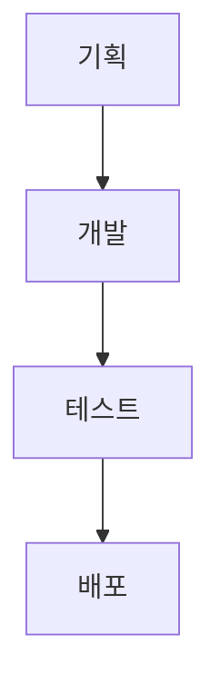
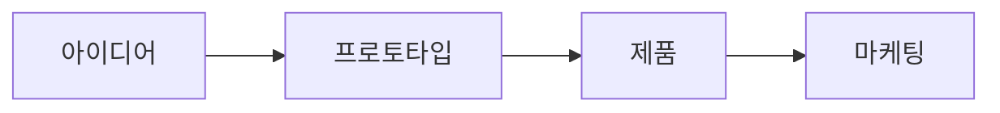
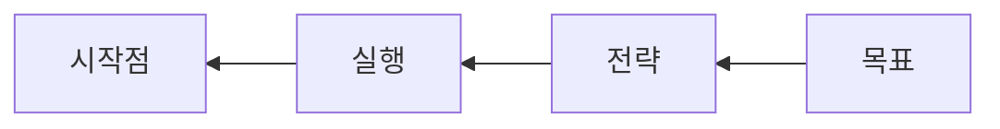
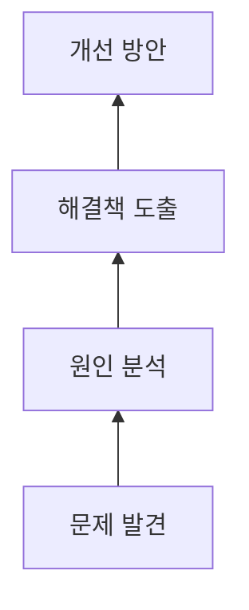

# 다이어그램 기초와 플로우차트 작성

## 방향 설정 (TD, LR, RL, BT)

Mermaid에서 다이어그램 방향 설정은 시각적 표현과 정보 전달에 중요한 역할을 함. 방향 설정을 통해 다이어그램의 전체적인 구조와 흐름을 효과적으로 제어할 수 있음.

### TD (Top Down)

TD 방향은 다이어그램을 위에서 아래로 그림. 주로 계층적 구조나 단계별 프로세스를 표현할 때 유용함.

```markdown
graph TD;
    A[기획] --> B[개발];
    B --> C[테스트];
    C --> D[배포];
```



이 방식은 소프트웨어 개발 생명주기나 조직도 등을 표현할 때 자주 사용됨.

### LR (Left to Right)

LR은 다이어그램을 왼쪽에서 오른쪽으로 펼쳐 보여줌. 시간 순서나 진행 과정을 나타낼 때 효과적임.

```markdown
graph LR;
    A[아이디어] --> B[프로토타입];
    B --> C[제품];
    C --> D[마케팅];
```



제품 개발 과정이나 워크플로우를 표현할 때 LR 방향이 적합함.

### RL (Right to Left)

RL은 오른쪽에서 왼쪽으로 흐르는 다이어그램을 만듦. 역방향 프로세스나 특정 문화권의 읽기 방향을 고려할 때 사용할 수 있음.

```markdown
graph RL;
    A[목표] --> B[전략];
    B --> C[실행];
    C --> D[시작점];
```



목표에서 시작점으로 거슬러 올라가는 계획 수립 과정 등을 표현할 때 유용함.

### BT (Bottom to Top)

BT는 다이어그램을 아래에서 위로 그림. 상향식 접근법이나 결과에서 원인을 찾아가는 과정을 표현할 때 적합함.

```markdown
graph BT;
    A[문제 발견] --> B[원인 분석];
    B --> C[해결책 도출];
    C --> D[개선 방안];
```



문제 해결 과정이나 피라미드 구조의 정보를 표현할 때 BT 방향을 활용할 수 있음.

### 방향 선택 시 고려사항

1. 정보의 흐름: 데이터나 프로세스의 자연스러운 흐름을 고려해 방향을 선택할 것
2. 가독성: 복잡한 다이어그램의 경우, 가장 읽기 쉬운 방향을 선택할 것
3. 공간 활용: 사용 가능한 공간에 따라 적절한 방향을 선택해 다이어그램을 효율적으로 배치할 것
4. 일관성: 같은 문서나 프로젝트 내에서는 일관된 방향을 사용해 혼란을 줄일 것
