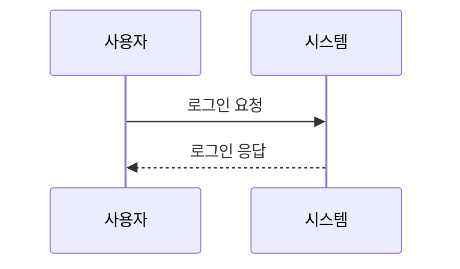
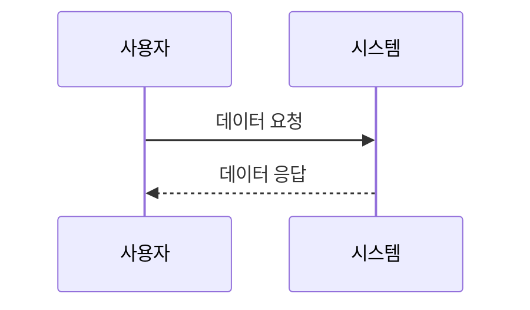
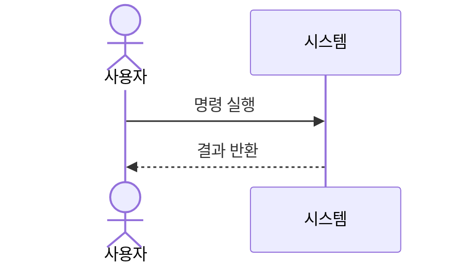
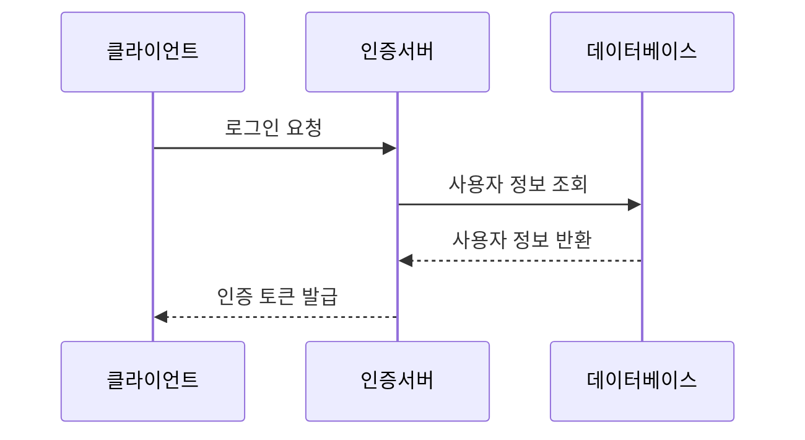
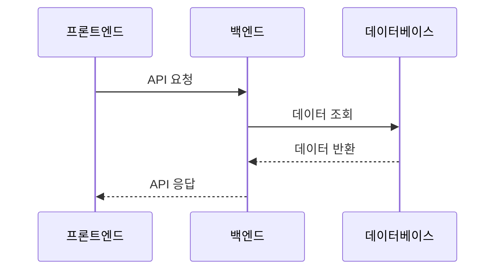

# 시퀀스 다이어그램 마스터하기

## 참여자 정의와 별칭 사용

시퀀스 다이어그램은 객체나 프로세스 간의 상호작용을 시간 순서대로 표현하는 강력한 도구임. Mermaid를 사용해 참여자를 정의하고 별칭을 활용하는 방법을 자세히 알아볼 것.

### 기본 참여자 정의

시퀀스 다이어그램에서 참여자는 `participant` 키워드로 정의함. 각 참여자는 다이어그램의 한 열을 차지하며, 메시지를 주고받는 주체가 됨.

```markdown
sequenceDiagram
    participant 사용자
    participant 시스템
    사용자->>시스템: 로그인 요청
    시스템-->>사용자: 로그인 응답
```



이 예시에서 '사용자'와 '시스템'이 참여자로 정의되어 있음.

### 별칭 활용하기

참여자 이름이 길거나 복잡할 때 별칭을 사용하면 다이어그램을 더 간결하게 만들 수 있음. 별칭은 `as` 키워드로 설정함.

```markdown
sequenceDiagram
    participant U as 사용자
    participant S as 시스템
    U->>S: 데이터 요청
    S-->>U: 데이터 응답
```



이 예시에서는 '사용자'를 'U'로, '시스템'을 'S'로 별칭을 지정해 다이어그램을 간소화함.

### 액터(Actor) 사용하기

사람이나 외부 시스템을 나타내고 싶을 때는 `actor` 키워드를 사용할 수 있음. 이는 스틱 피겨 모양으로 표시됨.

```markdown
sequenceDiagram
    actor U as 사용자
    participant S as 시스템
    U->>S: 명령 실행
    S-->>U: 결과 반환
```



여기서 '사용자'는 스틱 피겨로, '시스템'은 기본 직사각형 모양으로 표시됨.

### 복잡한 시나리오에서의 별칭 사용

여러 참여자가 있는 복잡한 시나리오에서 별칭 사용의 이점이 더욱 두드러짐.

```markdown
sequenceDiagram
    participant C as 클라이언트
    participant A as 인증서버
    participant D as 데이터베이스
    C->>A: 로그인 요청
    A->>D: 사용자 정보 조회
    D-->>A: 사용자 정보 반환
    A-->>C: 인증 토큰 발급
```



이 예시에서 각 참여자에 간단한 별칭을 사용해 복잡한 인증 프로세스를 명확하게 표현함.

### 참여자 정의 순서의 중요성

참여자를 정의하는 순서는 다이어그램에서 참여자가 나타나는 순서를 결정함. 따라서 논리적인 순서로 참여자를 정의하는 것이 중요함.

```markdown
sequenceDiagram
    participant F as 프론트엔드
    participant B as 백엔드
    participant D as 데이터베이스
    F->>B: API 요청
    B->>D: 데이터 조회
    D-->>B: 데이터 반환
    B-->>F: API 응답
```


