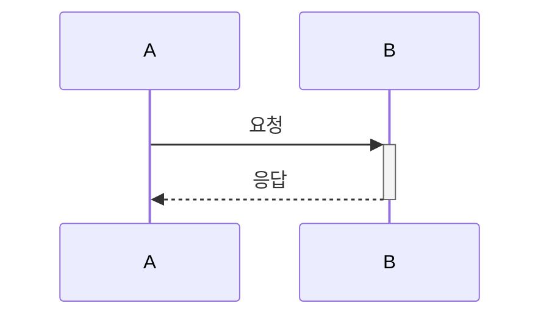
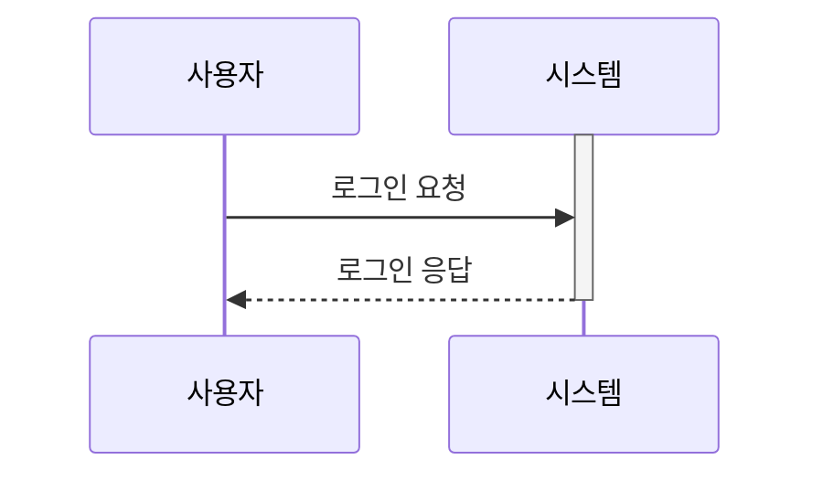
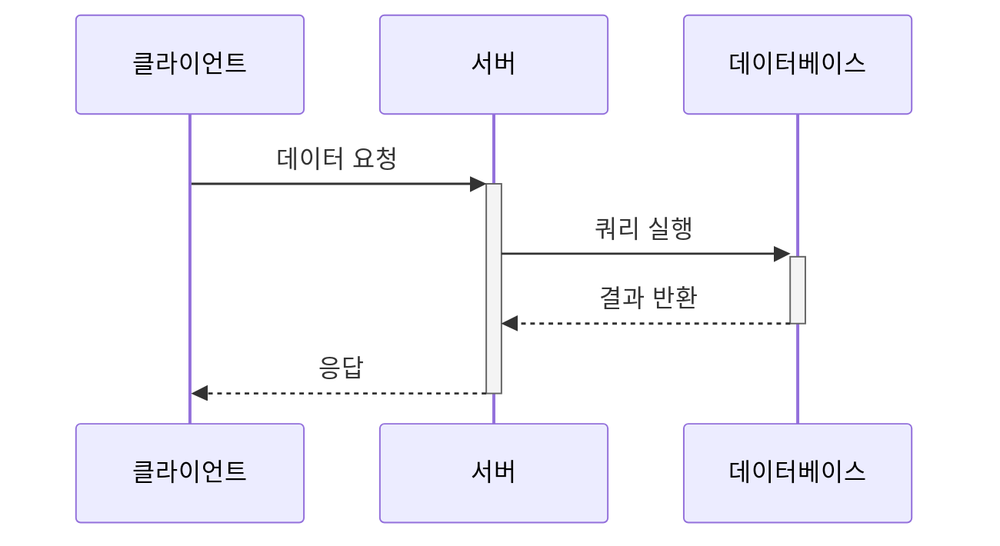
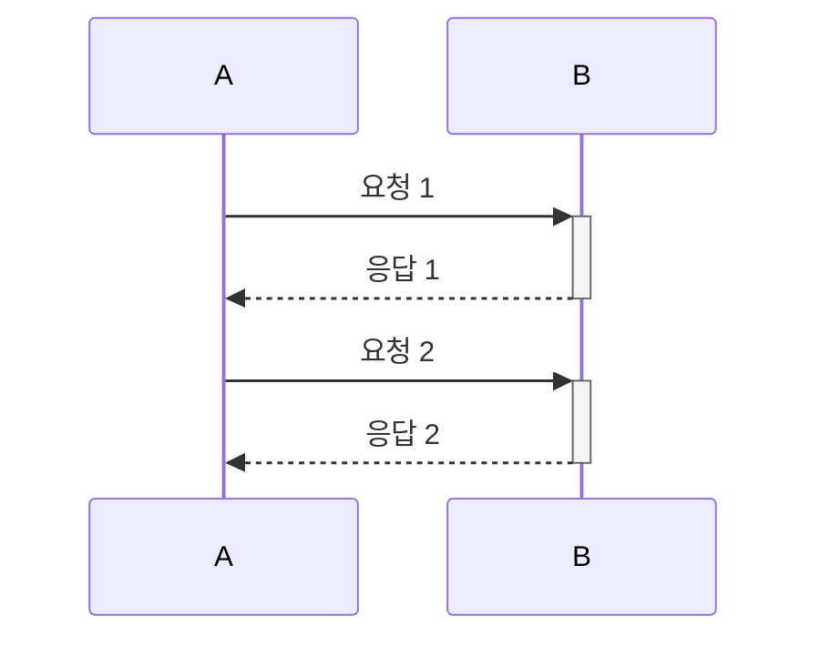
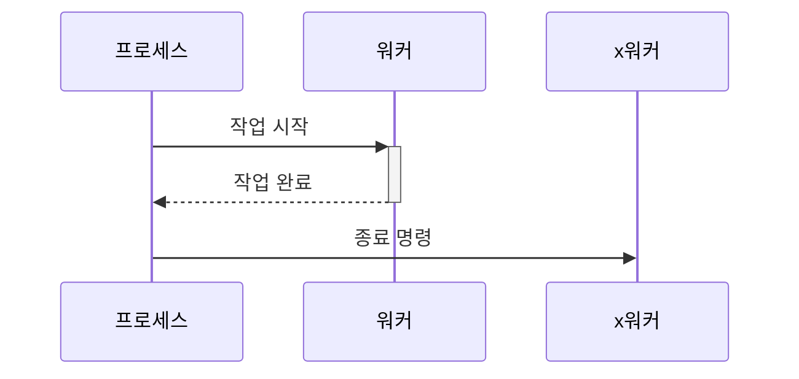
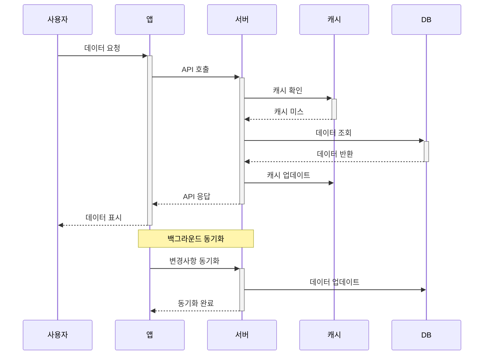

# 시퀀스 다이어그램 마스터하기

## 활성화 박스와 생명선 표현

활성화 박스와 생명선은 시퀀스 다이어그램에서 객체의 상태와 수명을 시각적으로 표현하는 중요한 요소임. 이를 통해 객체의 활성 상태와 존재 기간을 명확히 나타낼 수 있음.

### 활성화 박스 (Activation Box)

활성화 박스는 객체가 메시지를 처리하는 동안 활성 상태임을 나타냄. Mermaid에서는 `+`와 `-` 기호를 사용하여 활성화 박스를 표현함.

```markdown
sequenceDiagram
    participant A
    participant B
    A->>+B: 요청
    B-->>-A: 응답
```



이 예시에서 B는 요청을 받은 후 활성화되고, 응답을 보낸 후 비활성화됨.

### 생명선 (Lifeline)

생명선은 객체의 존재 기간을 나타냄. Mermaid에서는 자동으로 생명선을 그리며, `activate`와 `deactivate` 키워드로 명시적 제어가 가능함.

```markdown
sequenceDiagram
    participant 사용자
    participant 시스템
    activate 시스템
    사용자->>시스템: 로그인 요청
    시스템-->>사용자: 로그인 응답
    deactivate 시스템
```



이 예시에서 시스템은 명시적으로 활성화되고 비활성화됨.

### 중첩된 활성화 박스

객체가 다른 객체를 호출하는 동안 활성 상태를 유지하는 경우, 중첩된 활성화 박스로 표현할 수 있음.

```markdown
sequenceDiagram
    participant 클라이언트
    participant 서버
    participant 데이터베이스
    클라이언트->>+서버: 데이터 요청
    서버->>+데이터베이스: 쿼리 실행
    데이터베이스-->>-서버: 결과 반환
    서버-->>-클라이언트: 응답
```



이 예시에서 서버는 데이터베이스와 상호작용하는 동안 활성 상태를 유지함.

### 자동 활성화/비활성화

Mermaid는 메시지 화살표에 `+`와 `-`를 사용하여 자동으로 활성화 박스를 그릴 수 있음.

```markdown
sequenceDiagram
    participant A
    participant B
    A->>+B: 요청 1
    B-->>-A: 응답 1
    A->>+B: 요청 2
    B-->>-A: 응답 2
```



이 방식은 코드를 간결하게 유지하면서 활성화 상태를 명확히 표현할 수 있음.

### 생명선 종료

객체의 생명이 종료되는 시점을 표현하려면 `x` 기호를 사용할 수 있음.

```markdown
sequenceDiagram
    participant 프로세스
    participant 워커
    프로세스->>+워커: 작업 시작
    워커-->>-프로세스: 작업 완료
    프로세스->>x워커: 종료 명령
```



이 예시에서 워커는 작업 완료 후 종료됨.

### 실전 예제

복잡한 시스템의 상호작용을 표현하는 시퀀스 다이어그램을 작성해보자.

```markdown
sequenceDiagram
    participant 사용자
    participant 앱
    participant 서버
    participant 캐시
    participant DB

    사용자->>+앱: 데이터 요청
    앱->>+서버: API 호출
    서버->>+캐시: 캐시 확인
    캐시-->>-서버: 캐시 미스
    서버->>+DB: 데이터 조회
    DB-->>-서버: 데이터 반환
    서버->>캐시: 캐시 업데이트
    서버-->>-앱: API 응답
    앱-->>-사용자: 데이터 표시

    Note over 앱,서버: 백그라운드 동기화
    앱->>+서버: 변경사항 동기화
    서버->>DB: 데이터 업데이트
    서버-->>-앱: 동기화 완료
```



이 예제는 사용자, 앱, 서버, 캐시, 데이터베이스 간의 복잡한 상호작용을 보여줌. 활성화 박스와 생명선을 적절히 사용하여 각 객체의 상태 변화와 데이터 흐름을 명확하게 표현함.

활성화 박스와 생명선을 효과적으로 활용하면 복잡한 시스템의 동작을 더 쉽게 이해하고 설명할 수 있음. 각 객체의 활성 상태와 존재 기간을 명확히 표현하여, 시스템의 동작 흐름을 한눈에 파악할 수 있게 됨.
